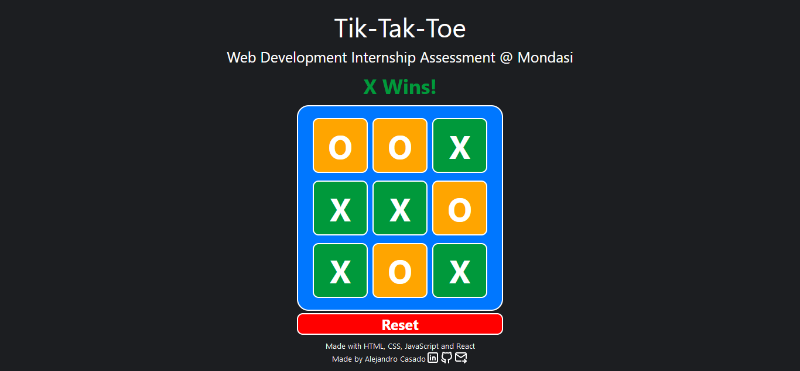

# Web Development Internship Assessment @ Mondasi

This project was made with HTML, CSS, JavaScript and React

 

In the project directory, you can run:

## `npm start`

Runs the app in the development mode.\
Open [http://localhost:3000](http://localhost:3000) to view it in your browser.

